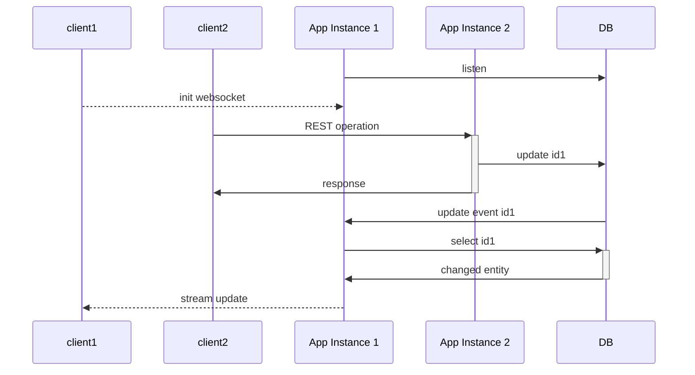

# about


# interaction



# dev

## swagger

[swagger](http://localhost:8080/swagger-ui.html)

## local dev db (docker-compose)

### start local dev db

```
docker-compose up -d
```

### interact with local dev db

```
docker exec -it $(docker-compose ps -q) psql -d dev_db -U dev
```

### run locally

```
./gradlew bootRun
```

Connect to websocket `ws://localhost:8080/events/item`

Interact via swagger (see above)